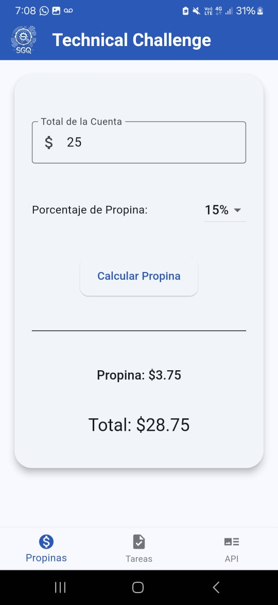
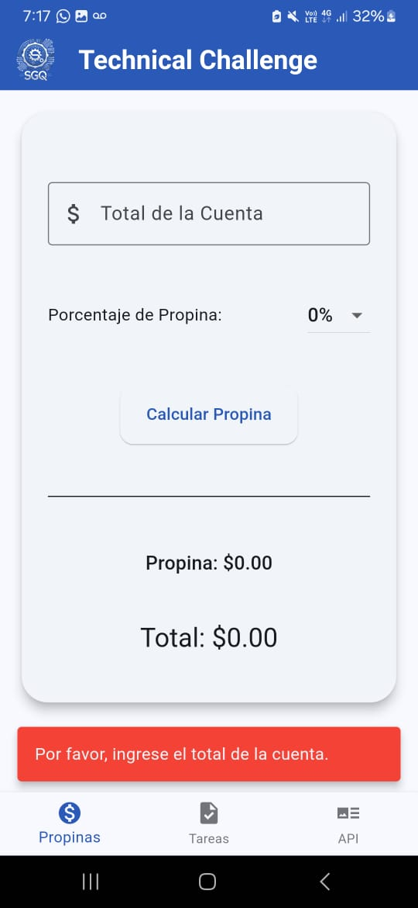

# TipCalc_TaskManager_API_Integration
Ejercicios

## Capturas de Pantalla

  
  

---

### 1. Calculadora de Propinas - Monto Ingresado
Esta captura muestra la pantalla de la calculadora de propinas con un monto de $25 ingresado. El porcentaje de propina seleccionado es del 15%. Al hacer clic en "Calcular Propina", la aplicación calcula y muestra la propina correspondiente de $3.75, sumando un total de $28.75.

### 2. Calculadora de Propinas - Monto No Ingresado (Validacion)
Esta captura muestra la pantalla de la calculadora de propinas cuando no se ha ingresado ningún monto en el campo "Total de la Cuenta". Al intentar calcular la propina, la aplicación muestra una alerta en rojo, indicando al usuario que debe ingresar un monto para poder realizar el cálculo.
