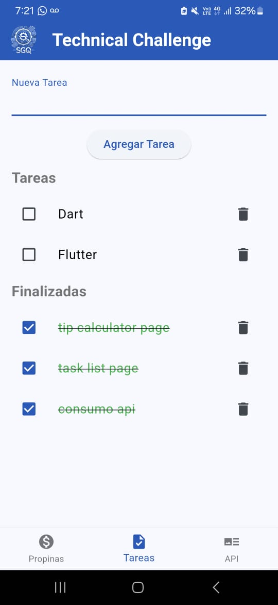
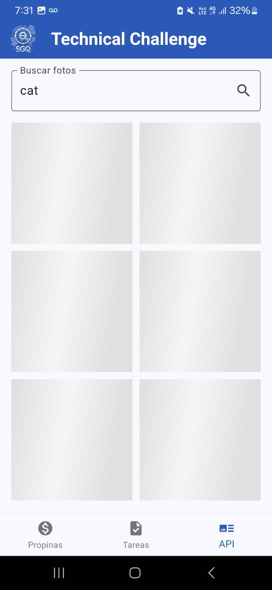
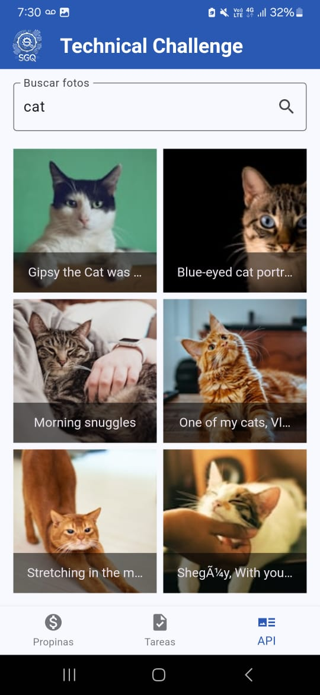
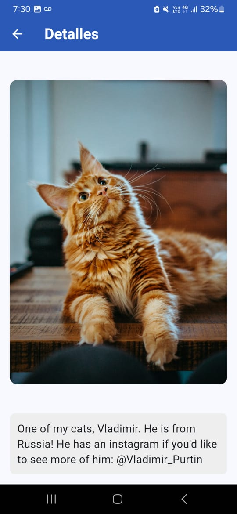

# TipCalc_TaskManager_API_Integration
Ejercicios

## Capturas de Pantalla

### 1. Calculadora de Propinas
#### a. Monto Ingresado
Muestra la pantalla de la calculadora de propinas con un monto de $25 ingresado. El porcentaje de propina seleccionado es del 15%. Al hacer clic en "Calcular Propina", la aplicación calcula y muestra la propina correspondiente de $3.75, sumando un total de $28.75.

#### b. Monto No Ingresado (Validación)
Muestra la pantalla de la calculadora de propinas cuando no se ha ingresado ningún monto en el campo "Total de la Cuenta". Al intentar calcular la propina, la aplicación muestra una alerta en rojo, indicando al usuario que debe ingresar un monto para poder realizar el cálculo.

  
  

---

### 2. Lista de Tareas - Tareas Completadas y Pendientes
Esta captura muestra la pantalla de la lista de tareas, donde las tareas "Dart" y "Flutter" están pendientes, mientras que las tareas "tip calculator page", "task list page" y "consumo api" están marcadas como completadas. Las tareas completadas se muestran tachadas y con un color verde, diferenciándose visualmente de las tareas pendientes.

  

---

### 3. Integración con la API - Búsqueda y Visualización de Imágenes
#### a. Carga de Resultados
Muestra la pantalla de la integración de la API, donde se inicia una búsqueda para la palabra "cat". En este estado, la aplicación está cargando las imágenes desde la API y se muestran cuadros de carga en lo que cargan las imágenes.

#### b. Resultados de la Búsqueda
Muestra la pantalla con los resultados de la búsqueda una vez que las imágenes han sido cargadas correctamente desde la API. Se muestran varias imágenes de gatos con sus respectivos títulos.

#### c. Visualización de Detalles
Al seleccionar una de las imágenes de la lista de resultados, la aplicación navega a una pantalla de detalles donde se muestra la imagen en tamaño completo junto con una descripción detallada del contenido.

  
  
  

---
